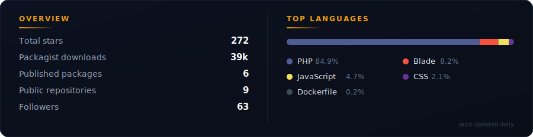

  

  
  
  
  
  
  

 

## ⚡ Kronn.io — what I'm building

> **Server management, from your first VPS to Kubernetes.**
> Deploy **PHP, Node, Python, Go and Docker** apps without touching SSH — from a single VPS to Swarm and Kubernetes clusters.

A platform in the Forge/Ploi category, built for everyone tired of choosing between *"too simple to scale"* and *"too complex to start"*. Provisioning, deploys, TLS, observability and rollbacks — in one place.

  

## 🧪 HubDev — one environment, every OS, every service

> **The universal dev environment for teams tired of setup hell.**
> One binary, three OSes — first-class Linux, Windows (no WSL) and macOS — with **40+ services** and a **native ↔ Docker toggle per service, at runtime**.

MySQL native for raw performance, Kafka in Docker for isolation, Redis native again — all in the same panel, switchable per service instead of all-or-nothing. GUI and CLI, from Postgres and MongoDB to Keycloak, ClickHouse, Kafka and Traefik.

  

## 🧩 Open source plugins for Filament v5

Packages I maintain on Packagist — **~38k downloads**, running in production on other teams' apps.

<table>
<tr>
<td width="50%" valign="top">

### [Filament Icon Picker](https://github.com/wallacemartinss/filament-icon-picker)

A modern icon picker for Filament v5, powered by `blade-ui-kit/blade-icons`. Instant search across any icon set.

</td>
<td width="50%" valign="top">

### [Filament Security](https://github.com/wallacemartinss/filament-security)

Eight layers of protection: disposable email blocking, DNS/MX verification, RDAP domain age checks, single session enforcement, honeypot bot protection, Cloudflare IP blocking, malicious scan detection, and a real-time security event dashboard.

</td>
</tr>
<tr>
<td width="50%" valign="top">

### [WhatsApp Connector](https://github.com/wallacemartinss/filament-whatsapp-conector)

WhatsApp inside your panel through Evolution API v2: real-time QR Code connection, webhooks, media sending, and interactive messages (buttons, lists, PIX, carousel). Multi-tenant out of the box.

</td>
<td width="50%" valign="top">

### [Filament Onboarding](https://github.com/wallacemartinss/filament-onboarding)

Database-driven onboarding: a checklist that follows the user across every page of the panel, spotlight tours, and steps completed by watching a video — with watch time measured, not guessed. Journeys are authored in the panel, no deploy needed.

</td>
</tr>
</table>

## 🛠️ Stack

**Backend** &nbsp;&nbsp;

**Mobile** &nbsp;&nbsp;&nbsp;&nbsp;

**Data** &nbsp;&nbsp;&nbsp;&nbsp;&nbsp;&nbsp;&nbsp;&nbsp;&nbsp;&nbsp;&nbsp;

**Cloud** &nbsp;&nbsp;&nbsp;&nbsp;&nbsp;&nbsp;&nbsp;

**Infra** &nbsp;&nbsp;&nbsp;&nbsp;&nbsp;&nbsp;&nbsp;&nbsp;&nbsp;&nbsp;&nbsp;

## 📊 GitHub

  

## 👨‍💻 About

Founder of **[Kronn.io](https://kronn.io)** and **[HubDev.io](https://hubdev.io)**.

Over **18 years in technology**, with a career built at the intersection of cloud infrastructure, IT governance and software development. I've worked at large private financial institutions — **Banco Next**, **Itaú Unibanco** and **Citigroup** — leading digital transformation projects that delivered millions in savings.

Today I pair a solid foundation in **multicloud engineering** (Azure, AWS, GCP) with full-stack development in **Laravel** and mobile apps in **Flutter**. I hold **multiple Microsoft Azure certifications**, alongside **ITIL V3**, **ITIL RCV**, **Green Belt** and **Scrum** — a rare combination that lets me deliver everything from the infrastructure architecture down to the application code.

**Trilingual** (Portuguese, Spanish and English), I've led international projects across **Colombia, Chile, Argentina, Uruguay and Australia**.

Away from the keyboard: **RC aircraft** and **electronics**.

If any of these packages saved you time, consider [sponsoring me on GitHub](https://github.com/sponsors/wallacemartinss) — it's what keeps them alive. 🙏

   
  
  
  
  
  
    
  <i>"Code is my craft, and GitHub is my gallery."</i>

